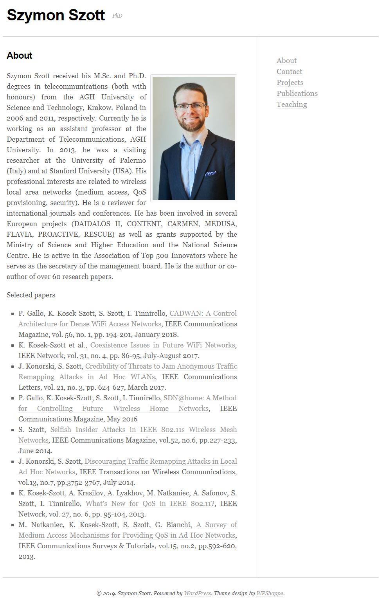

+++
title = "Hello World"
subtitle = "Moving from Wordpress to static HTML"

# Add a summary to display on homepage (optional).
summary = ""

date = 2019-04-26T15:17:45+02:00
draft = false

# Authors. Comma separated list, e.g. `["Bob Smith", "David Jones"]`.
authors = ["Szymon Szott"]

# Is this a featured post? (true/false)
featured = false

# Tags and categories
# For example, use `tags = []` for no tags, or the form `tags = ["A Tag", "Another Tag"]` for one or more tags.
tags = ["homepage"]
categories = []

# Projects (optional).
#   Associate this post with one or more of your projects.
#   Simply enter your project's folder or file name without extension.
#   E.g. `projects = ["deep-learning"]` references
#   `content/project/deep-learning/index.md`.
#   Otherwise, set `projects = []`.
# projects = ["internal-project"]

# Featured image
# To use, add an image named `featured.jpg/png` to your page's folder.
[image]
  # Caption (optional)
  caption = ""

  # Focal point (optional)
  # Options: Smart, Center, TopLeft, Top, TopRight, Left, Right, BottomLeft, Bottom, BottomRight
  focal_point = ""
+++

I'm happy to have managed to move my homepage from Wordpress before it got hacked! It's not that Wordpress doesn't issue security updates, it's that these updates kept braking the minimalist theme I was using. Also, that theme  didn't scale well to the available screen size. Looking for a static HTML solution, I came upon [Hugo](https://gohugo.io/) and its [Academic](https://sourcethemes.com/academic/) theme. I believe it does a good job of presenting the research I'm doing and will allow me to do the occasional blog post. Please, [let me know](/#contact) what you think of the new website! Meanwhile here's a last look at my previous, Wordpress-based homepage:

