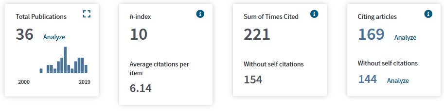
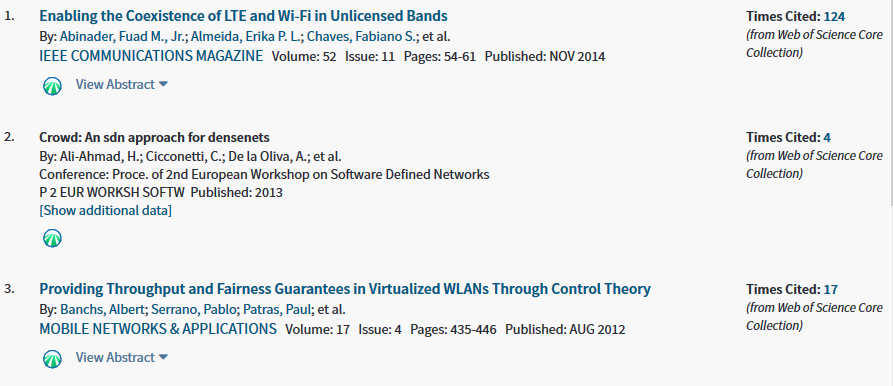
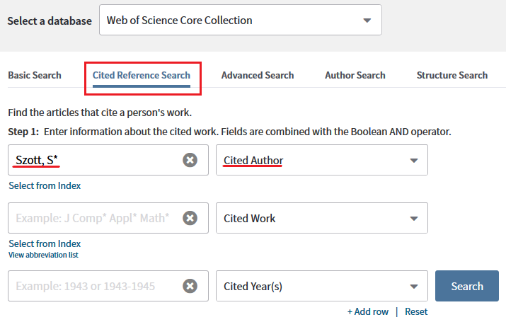
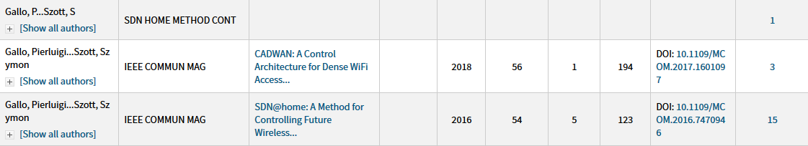
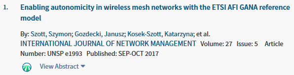
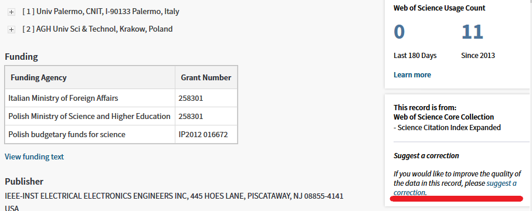

## Introduction

The [Web of Science](https://clarivate.com/products/web-of-science/) (WoS) is a citation database which allows researchers to calculate the bibliometric impact of their work. The metrics WoS calculates (such as the [h-index](https://en.wikipedia.org/wiki/H-index)) are important for researchers who are applying for a promotion or a research grant.  Here's my citation report from WoS as an example:

WoS generates these metrics by analyzing each research paper in its database and linking the cited references in this paper with the entries of these references in the WoS database. Here's the beginning of an example list of cited references from [Coexistence Issues in Future WiFi Networks](../../publication/coexistence-issues):

The problem with WoS is that the abovementioned linking is done automatically which can lead to errors. In the example above references [1] and [3] are correctly linked (with the paper's title, authors, and journal name being links as well). Meanwhile, reference [2] is not correctly linked and will not count towards the citation metrics of these authors. Sometimes this is because the cited reference is simply not in the WoS database (which is quite stringent). But sometimes, this is due to an error of the automated process. In this tutorial, I would like to show how researchers can find such missing references and have them included in their citation count.

## Finding Missing References

The key to finding “unlinked references” is using Cited Reference Search in combination with an author name search. Here's a short video tutorial explaining how Cited Reference Search works:

<iframe width="560" height="315" src="https://www.youtube.com/embed/gXNo73qB7g4" frameborder="0" allow="accelerometer; autoplay; encrypted-media; gyroscope; picture-in-picture" allowfullscreen></iframe>

To find your own unlinked references, you need to switch from the default Basic Search to Cited Reference Search and search by Cited Author:

The next step is to look carefully through the results (which can be exported as an Excel file for easier filtering). Here's part of the search results which I got from the above query:

The second and third rows contain entries which are correct (they have a linked title, DOIs, etc.), while the first row is an entry which is a badly cited reference to my [SDN@home](../../publication/sdn-at-home/) paper. Using the link in the rightmost column we can find out which papers use this incorrect reference:

In my case there's only one such paper and it's actually one in which I was the main author ([Enabling autonomicity...](../../publication/gana-mesh)). Was the reference incorrect in our submission? No, as you can [see in this PDF](../../publication/gana-mesh/gana-mesh.pdf). The above is a good example of the errors that can occur in the automated linking process that WoS uses. Having found the unlinked references, we can proceed to the next stage.

## Reporting Missing References

At this point we have two papers:

- Paper A (in our case: [SDN@home](../../publication/sdn-at-home/))
- Paper B (in our case: [Enabling autonomicity...](../../publication/gana-mesh))

and paper B contains an unlinked reference to paper A. The procedure for reporting the missing reference is to:

1. Navigate to paper A's page in WoS

2. Click on the "suggest a correction" link:
   
   
3. Fill out the data change form:
   
   - Add your contact information 
   
   - As "Type of Change" select "Times Cited"
   
   - Paper A's data should be prefilled in the form
   
   - As "Change Requested" type in something similar to the following (with your own paper B's data):
   
      > This paper is cited by:   
      > 1) Title: Enabling autonomicity in wireless mesh networks with the ETSI AFI GANA reference model   
      > DOI: 10.1002/nem.1993   
      > Accession Number: WOS:000417433600006 
   
      Alternatively, in this step you can upload a filled out [Missing Citation Template](MissingCitationTemplateResource.xls). It's important to use the "Accession Number", which WoS uses as an internal index.
   
4. Click the "Submit" button

You should shortly receive an email with a "Case number" and the entry should be corrected within a few days.

## Discussion

Unfortunately, the procedure outlined above has to be done by hand for each of your cited papers (although you can report multiple "paper Bs" for each "paper A"). In my experience, this "cultivating" of your citations can give a 10-20% increase in your bibliographic metrics. If you have any suggestions for improving this procedure please [let me know](/#contact) or leave a comment below.